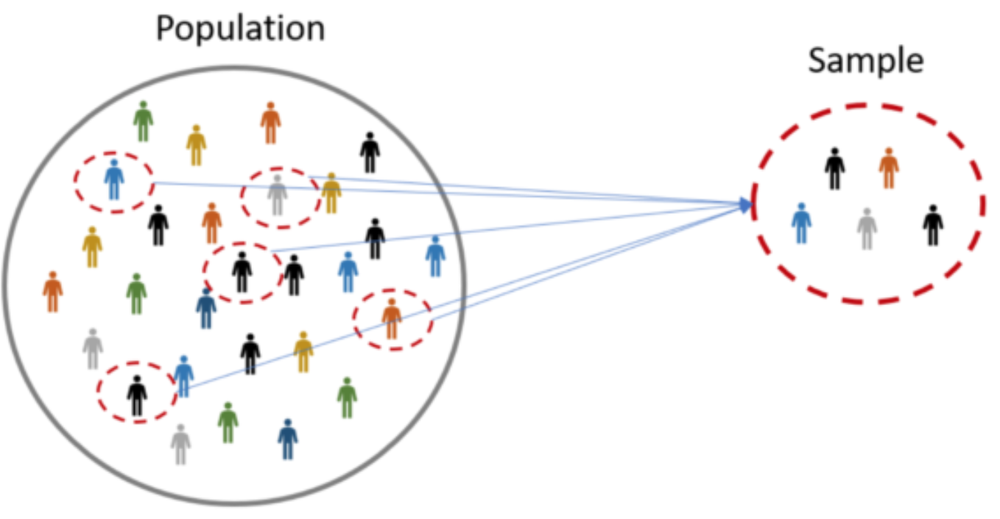
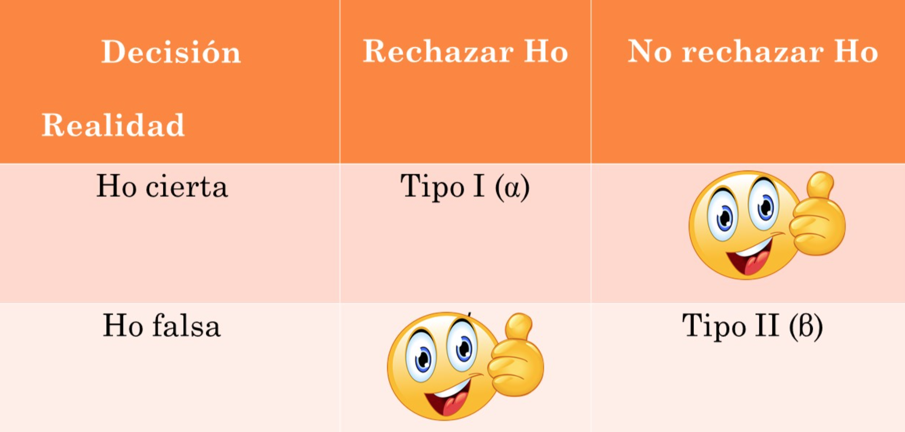
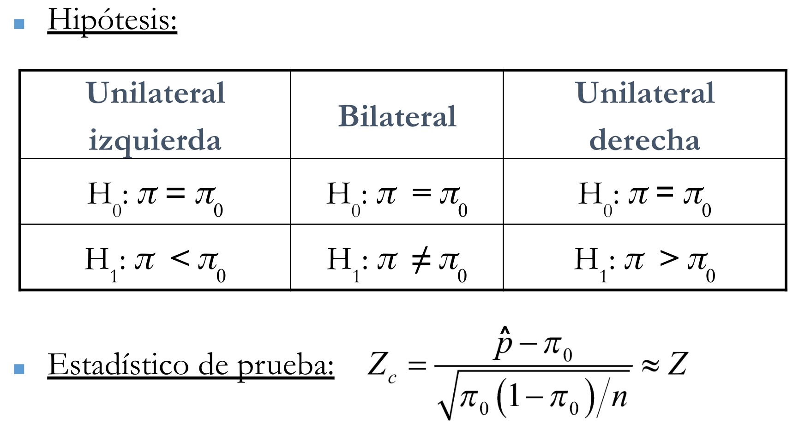
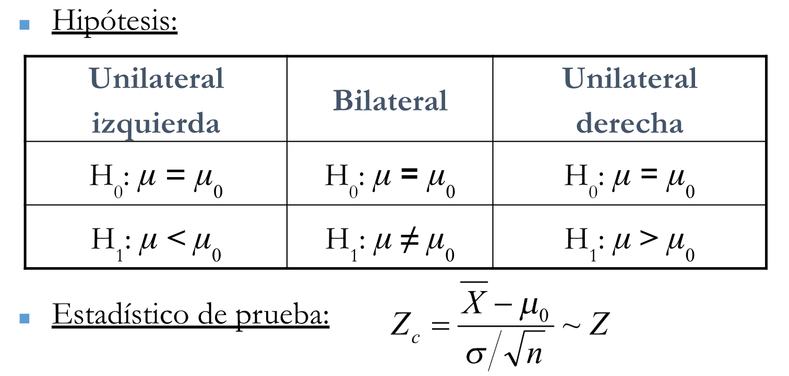
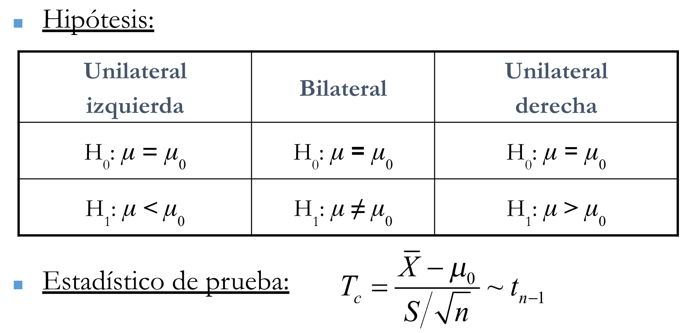
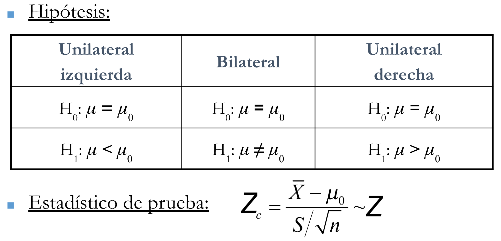

# Conceptos Básicos

### Estadística

-  Según la *American Statistical Association.* la **Estadística** es la ciencia de aprender de los datos, medir, controlar y comunicar la incertidumbre. 

- Los libros tradicionales, la **Estadística** es la ciencia que estudia los métodos y técnicas para: *Recolectar, Organizar, Analizar y Presentar los datos*, con la finalidad de tomar decisiones objetivas.


### Clasificación de la Estadística

1. `Estadística Descriptiva`: Se encarga de resumir y describir los datos, mediante medidas de resumen, diagramas y tablas.

2. `Estadística Inferencial`: Se encarga de generalizar, predecir (inferir) los resultados obtenidos en una muestra a toda la población, controlando la incertidumbre.

### Términos Estadísticos

- `Población`: Es el conjunto de individuos u objetos de estudio
que comparten una misma característica y que serán analizados.

- `Muestra`: Es un subconjunto **representativo** de la población. 

    - Se estudia la muestra por que muchas veces no es posible estudiar a toda la población.
    - La muestra debe ser representativa para garantizar que los resultados pueden ser generalizados a toda la población.
    - La representatividad se garantiza utilizando técnicas de muestreo basadas en la aleatoriedad.

```{r, out.width = "400px", fig.align='center'}

```

- `Parámetro`: Es un valor que describe una caracteristica de una **Población**, por ejemplo:

    - Media: $\mu$
    - Varianza: $\sigma^2$
    - Proporción $\pi$, etc.

- `Estadístico`: Es un valor que describe una caracteristica de una **Muestra**, por ejemplo:

    - Media muestral $\bar{X}$
    - Varianza muestral $S^2$
    - Proporción Muestral $\hat{p}$, etc.

- `Variable Aleatoria`: Es una característica de los elementos de la muestra. El valor de una variable aleatoria se llama **DATO**.

- `Tipos Variables Aleatorias`

    - Variables Cualitativas (categoricas)
    
        1. Nominal (ejemplo: género)
        2. Ordinal (ejemplo: grado de instrucción)
    
    - Variables Cuantitativas (numéricas)
    
        1. Discreta (ejemplo: número de hijos)
        2. Continua (ejemplos: edad, peso)


### Distribucion Normal


$$f(x)=\frac{1}{\sigma\sqrt{2\pi}}e^{-\frac{(x-\mu)^2}{2\sigma^2}}$$

    
- La distribución normal, también conocida como distribución gaussiana, es una distribución de probabilidad que se usa comúnmente en el análisis estadístico. Es una distribución de probabilidad continua que es simétrica alrededor de la media, con una curva en forma de campana.

- La distribución normal se caracteriza por dos parámetros: la media $\mu$ y la desviación estándar $\sigma$. La media representa el centro de la distribución, mientras que la desviación estándar representa la propagación de la distribución.


### Distribucion Normal Estandar 

$$f(z)=\frac{1}{\sqrt{2\pi}}e^{-\frac{z^2}{2}}$$

- La distribución normal Estandar tiene media **cero** y desviación estándar **uno**.

- `Resumen`

```{r}
xvalues <- data.frame(x = c(-3, 3))
dnorm_three_sd <- function(x){
  norm_three_sd <- dnorm(x)
  # Have NA values outside interval x in [-1, 1]:
  norm_three_sd[x <= -3 | x >= 3] <- NA
  return(norm_three_sd)
}
dnorm_two_sd <- function(x){
  norm_two_sd <- dnorm(x)
  # Have NA values outside interval x in [-1, 1]:
  norm_two_sd[x <= -2 | x >= 2] <- NA
  return(norm_two_sd)
}
dnorm_one_sd <- function(x){
  norm_one_sd <- dnorm(x)
  # Have NA values outside interval x in [-1, 1]:
  norm_one_sd[x <= -1 | x >= 1] <- NA
  return(norm_one_sd)
}
area_one_sd <- round(pnorm(1) - pnorm(-1), 4)
ggplot (xvalues, aes (x)) + stat_function(fun = dnorm)+
  stat_function(fun = dnorm_three_sd, geom = "area", fill = "cyan", alpha = 0.3) +
  stat_function(fun = dnorm_two_sd, geom = "area", fill = "magenta", alpha = 0.3) +
  stat_function(fun = dnorm_one_sd, geom = "area", fill = "yellow", alpha = 0.3) +
  geom_vline(xintercept = 0, colour = "black", linetype = "dashed")+
  geom_text(x = 0.5, y = 0.2, size = 3.5, fontface = "bold",
            label = paste0(round(area_one_sd * 100/2,2),"%")) +
  geom_text(x = -0.5, y = 0.2, size = 3.5, fontface = "bold",
            label = paste0(round(area_one_sd * 100/2,2),"%")) +
  geom_text(x = 1.5, y = 0.05, size = 3.5, fontface = "bold",
            label = paste0(round((pnorm(2)-pnorm(1)) * 100,2),"%")) +
  geom_text(x = -1.5, y = 0.05, size = 3.5, fontface = "bold",
            label = paste0(round((pnorm(-1)-pnorm(-2)) * 100,2),"%")) +
  geom_text(x = 2.3, y = 0.01, size = 3.5, fontface = "bold",
            label = paste0(round((pnorm(3)-pnorm(2)) * 100,2),"%")) +
  geom_text(x = -2.3, y = 0.01, size = 3.5, fontface = "bold",
            label = paste0(round((pnorm(-2)-pnorm(-3)) * 100,2),"%")) +
  scale_x_continuous(breaks = c(-3:3)) + 
  labs(x = "\n z", y = "f(z) \n", title = "Distribución Normal Estandar: Propiedades \n") +
  theme(plot.title = element_text(hjust = 0.5), 
        axis.title.x = element_text(face="bold", colour="brown", size = 12),
        axis.title.y = element_text(face="bold", colour="brown", size = 12))
```


# R y RStudio

-  **R** es un lenguaje de programación y entorno de software libre para el análisis estadístico, el modelado y la visualización de datos <https://www.r-project.org>. 

- **RStudio** es un entorno de desarrollo integrado (IDE) de código abierto y una interfaz gráfica de usuario (GUI) para el lenguaje de programación **R** <https://posit.co/download/rstudio-desktop/>.

- Para instalar R y Rstudio ver: <https://www.youtube.com/watch?v=hbgzW3Cvda4>

# Prueba de Hipótesis

### Introducción

- Las **pruebas de hipótesis** son una herramienta para hacer inferencia estadística sobre los parámetros de una población.

- La **prueba de hipótesis** es un procedimiento que rechaza o no una afirmación acerca de una característica de la población, con base en la información de una muestra.

### Hipótesis Estadística

- Una **hipótesis estadística** ($H$), es una afirmación sobre la población, que comúnmente se expresa por medio de un parámetro.

    - **Hipótesis Nula** ($H_0$): afirmación del estado actual de conocimiento de la población. Es la hipótesis que al final del procedimineto se debe rechazar o no rechazar.
    
    - **Hipótesis Alternativa** ($H_1$): afirmación sobre la cual se quiere hallar evidencia empírica (afirmación contraria a $H_0$).

- Sistema de Hipótesis: 
    
    - $H_0$ versus $H_1$
    
- Ejemplo

Cierto tipo de motor de automóvil emite una media de 100 mg de óxidos de nitrógeno (NO) por segundo con 100 caballos de fuerza. Se ha propuesto una modificación al diseño del motor para reducir las emisiones de NO. El nuevo diseño se producirá si se demuestra que la media de las emisiones es menor de 100 mg/seg. Se construye y se prueba una muestra de 50 motores modificados. La media muestral de emisiones de NO es de 92 mg/s, y la desviación estándar muestral es de 21 mg/s.

- **Población**: emisiones de NO (mg/s) de los motores con el diseño del motor modificado.
- **Valor hipotético**: $\mu_0=100$.
- **Sistema de hipótesis**: $H_0:\mu = 100$ frente a $H_1:\mu < 100$.
- **Información muestral**: $n=50$, $\bar{x} = 92$ mg/s, y $s = 21$ mg/s.

### Errores

Cuando se hace una prueba de hipótesis podría ocurrir que la muestra no dé evidencias acerca de lo que ocurre en la población:

{width=90%}

El **error tipo I** consiste en **rechazar la hipótesis nula, cuando ésta es cierta**. 

La **probabilidad de cometer el error tipo I** se llama **nivel de significancia** ($\alpha$) y **se fija antes de iniciar el estudio**:

$$\alpha = \textsf{Pr}(\text{Rechazar }H_0\mid H_0\text{ es cierta})$$

El complemento de $\alpha$ es la **confiabilidad**:

$$1-\alpha = \textsf{Pr}(\text{No rechazar }H_0\mid H_0\text{ es cierta})$$

El **error tipo II** consiste en **no rechazar la hipótesis nula, cuando ésta es falsa**. 

La **probabilidad de cometer el error tipo II** se llama **función característica** ($\beta(\theta)$) porque se puede calcular para cada $\theta\in\Theta_1$:

$$\beta(\theta)=\textsf{Pr}(\text{No rechazar }H_0\mid H_0\text{ es falsa})$$

El complemento de $\beta(\theta)$ se llama **función de potencia**:

$$\pi(\theta)=1-\beta(\theta) = \textsf{Pr}(\text{Rechazar }H_0\mid H_0\text{ es falsa})$$


### Observaciones

- El nivel de significancia se fija de antemano a 0.1, 0.05, o 0.01. 
- $H_0$ se mantiene a menos de que haya suficiente evidencia para revocarla.
- Para rechazar $H_0$, se debe observar algo en la muestra tan improbable que ocurra si $H_0$ es cierta, que obliga al investigador a favorecer $H_1$ (rechazar $H_0$).

### Ejemplo

En un juicio en un tribunal:

- Error tipo I:  establecer que el acusado es culpable, cuando en realidad es inocente.
- Error tipo II: establecer que el acusado es inocente, cuando en realidad es culpable.

### Ejemplo

En el ejemplo de emisiones de óxidos de nitrógeno (NO):

- Error tipo I: establecer que el diseño del motor modificado sí reduce las emisiones de NO promedio a menos de 100 mg/seg, cuando en realidad no lo hace.
- Error tipo II: establecer que el diseño del motor modificado no reduce las emisiones de NO promedio a menos de 100 mg/seg, cuando en realidad sí lo hace.

### Procedimiento de prueba

¿Cómo decidir si se debe rechazar o no la hipótesis nula?

1. Establecer el sistema de hipótesis.
2. Fijar el nivel de significancia.
2. Calcular el valor del estadístico de prueba, luego el valor de $p$ .
3. Tomar la decisión.
4. Interpretar los resultados.

### Valor-P (p-value)

El valor $p$ se define como


$$
p = \textsf{Pr}(\text{Observar datos tan o más extremos en dirección de } H_1\mid H_0\text{ es cierta})
$$
El test consiste en:

$$\text{Rechazar }H_0\text{ si el valor }p<\alpha$$

# P.H. para la Proporción

{width=90%}

### Ejemplos:

1. El administrador del restaurante “IL FORNO” debe tomar varias decisiones (con $\alpha=0.05$): **“Lanzar la promoción Comen cuatro y pagan tres”** si la proporción de mesas ocupadas con más de tres personas es menor de 0.3. Se toma al azar 80 mesas y se encuentra que hay 22 mesas ocupadas con más de tres personas. ¿Se lanzará la promoción?

**Sistema de hipótesis**: $H_0:\pi = 0.3$ frente a $H_1:\pi < 0.3$.

**Nivel de significancia**: $\alpha = 0.05$.


**Estadístico de Prueba**: 


$$Z_c = \frac{\hat{p} - \pi_0}{\sqrt{\pi_0(1-\pi_o)/n}}\sim\textsf{N}(0,1)$$

que al calcularse con la información muestral ($n=80$, $\hat{p} = 22/80$) da como resultado $z_c=-0.48795$.

La **región crítica** (región de rechazo) es $(-\infty,-1.645)$.

```{r}
# info muestral
n   <- 80
pest  <- 22/80
# valor hipotetico
pi0 <- 0.3
# estadistico de prueba
est <- (pest - pi0)/(sqrt(pi0*(1-pi0)/n))
print(est)
# percentil 5% (cola izquierda)
z05 <- qnorm(p = 0.05)
z05
```

```{r, fig.align='center', echo = F}

curve(expr = dnorm(x), col = 1, lwd = 2, from = -4, to = 4, xlab = "z", ylab = "Densidad", main = "")
grid <- seq(from = -4, to = z05, len = 1000)
polygon(x = c(-4,grid,z05), y = c(0,dnorm(grid),0), col = "orange", border = "orange")
grid <- seq(from = z05, to = 4, len = 1000)
polygon(x = c(z05,grid,4), y = c(0,dnorm(grid),0), col = "lavenderblush", border = "lavenderblush")
text(x =  3, y = 0.22, "95%", cex = 2.5, col = "lavenderblush3")
text(x = -3.4, y = 0.1, "5%", cex = 2.5, col = "orange")
curve(expr = dnorm(x), col = 1, lwd = 2, add = T)
abline(v = est, col = 2, lwd = 2)
abline(v = z05, col = 3, lwd = 2)
legend("topright", legend = c("Zc = -0.48795", "Z = -1.645"), col = c(2,3), lwd = 2, bty = "n")
```

El valor $p$ es 

$$p = \textsf{Pr}(Z < z_c\mid H_0\text{ es cierta}) = \int_{-\infty}^{z_c} f_Z(z)\,\textsf{d}z$$


```{r}
# valor p
pnorm(q = est, lower.tail = TRUE)
```


```{r, fig.align='center', echo = F}
curve(expr = dnorm(x), col = 1, lwd = 2, from = -4, to = 4, xlab = "z", ylab = "Densidad", main = "")
grid <- seq(from = -4, to = est, len = 1000)
polygon(x = c(-4,grid,est), y = c(0,dnorm(grid),0), col = "royalblue", border = "royalblue")
text(x = -3, y = 0.1, "31.28%", cex = 2, col = "royalblue")
curve(expr = dnorm(x), col = 1, lwd = 2, add = T)
abline(v = est, col = 2, lwd = 2)
abline(v = z05, col = 3, lwd = 2)
legend("topright", legend = c("Zc = -0.48795", "Z = -1.645"), col = c(2,3), lwd = 2, bty = "n")
```

**Decisión**: No rechazar $H_0$ dado que el P-valor $= 0.3128 > \alpha = 0.05$.


### Prueba para una Proporción directa


- `binom.test()`: Recomendado cuando el tamaño de muestra es pequeño ($n<30$).

- `prop.test()`: Puede ser usando cuando el tamaño de muestra es grande ($n\geq 30$).


```{r}
binom.test(x = 22, n = 80, p = 0.3, alternative = "less", conf.level = 0.95)
```


```{r}
prop.test(x = 22, n = 80, p = 0.3, alternative = "less", conf.level = 0.95, correct = FALSE)
```


# P.H. para la Media ($\sigma$ conocida)

{width=90%}

# P.H. para la Media ($\sigma$ desconocida)

### Muestra Pequeña ($n<30$)

{width=90%}

### Muestra Grande ($n\geq30$)

{width=90%}

En el ejemplo de emisiones de óxidos de nitrógeno (NO):

**Sistema de hipótesis**: $H_0:\mu = 100$ frente a $H_1:\mu < 100$.

**Nivel de significancia**: $\alpha = 0.05$.

**Valor $p$**: 

Bajo $H_0$, se tiene que el **estadístico de prueba** es

$$Z = \frac{\bar{X} - \mu_0}{S/\sqrt{n}}\sim\textsf{N}(0,1)$$
que al calcularse con la información muestral ($n=50$, $\bar{x} = 92$, $s = 21$) da como resultado $z_c=-2.69$.

La **región crítica** (región de rechazo) es $(-\infty,-1.64)$.

```{r}
# info muestral
n   <- 50
xb  <- 92
s   <- 21
# valor hipotetico
mu0 <- 100
# estadistico de prueba
est <- (xb - mu0)/(s/sqrt(n))
print(est)
# percentil 5% (cola izquierda)
z05 <- qnorm(p = 0.05)
z05
```

```{r, fig.align='center', echo = F}
n   <- 50
xb  <- 92
s   <- 21
mu0 <- 100
est <- (xb - mu0)/(s/sqrt(n))
z05 <- qnorm(p = 0.05)
curve(expr = dnorm(x), col = 1, lwd = 2, from = -4, to = 4, xlab = "z", ylab = "Densidad", main = "")
grid <- seq(from = -4, to = z05, len = 1000)
polygon(x = c(-4,grid,z05), y = c(0,dnorm(grid),0), col = "orange", border = "orange")
grid <- seq(from = z05, to = 4, len = 1000)
polygon(x = c(z05,grid,4), y = c(0,dnorm(grid),0), col = "lavenderblush", border = "lavenderblush")
text(x =  3, y = 0.22, "95%", cex = 2.5, col = "lavenderblush3")
text(x = -3.4, y = 0.1, "5%", cex = 2.5, col = "orange")
curve(expr = dnorm(x), col = 1, lwd = 2, add = T)
abline(v = est, col = 2, lwd = 2)
legend("topright", legend = c("z = -2.69"), col = 2, lwd = 2, bty = "n")
```

El valor $p$ es 

$$p = \textsf{Pr}(Z < z_c\mid H_0\text{ es cierta}) = \int_{-\infty}^{z_c} f_Z(z)\,\textsf{d}z = 0.003532762$$
```{r}
# valor p
pnorm(q = est, lower.tail = TRUE)
```

```{r, fig.align='center', echo = F}
n   <- 50
xb  <- 92
s   <- 21
mu0 <- 100
est <- (xb - mu0)/(s/sqrt(n))
z05 <- qnorm(p = 0.05)
curve(expr = dnorm(x), col = 1, lwd = 2, from = -4, to = 4, xlab = "z", ylab = "Densidad", main = "")
grid <- seq(from = -4, to = est, len = 1000)
polygon(x = c(-4,grid,est), y = c(0,dnorm(grid),0), col = "royalblue", border = "royalblue")
text(x = -3.4, y = 0.1, "0.35%", cex = 2, col = "royalblue")
curve(expr = dnorm(x), col = 1, lwd = 2, add = T)
abline(v = est, col = 2, lwd = 2)
abline(v = z05, col = "orange", lwd = 2)
legend("topright", legend = c("z = -2.69", "z = -1.64"), col = c(2,"orange"), lwd = 2, bty = "n")
```

**Intervalo de confianza unilateral**:

Utilizando la cantidad pivotal se tiene que
$$
\textsf{Pr}\left( \textsf{z}_\alpha <  Z \right) = \textsf{Pr}\left( \textsf{z}_\alpha <  \frac{\bar{X} - \mu}{S/\sqrt{n}} \right) = \textsf{Pr}\left( \mu < \bar{X} - \text{z}_{\alpha}\,\frac{S}{\sqrt{n}}  \right) = \textsf{Pr}\left( \mu < \bar{X} + \text{z}_{1-\alpha}\,\frac{S}{\sqrt{n}}  \right)  = 1-\alpha
$$

El intervalo calculado es $(-\infty; 96.88)$.

```{r}
# info muestral
n  <- 50
xb <- 92
s  <- 21
# percentiles
z05 <- qnorm(p = 0.05)
z95 <- qnorm(p = 0.95)
```

```{r}
# intervalo de confianza unilateral al 95%
xb - z05*s/sqrt(n)
xb + z95*s/sqrt(n)
```

**Decisión**: rechazar $H_0$ dado que $p = 0.0035 < \alpha = 0.05$.

**Conclusión**: existe suficiente evidencia empírica para establecer que el diseño del motor modificado **sí reduce significativamente** las emisiones de NO promedio a menos de 100 mg/s.


### Prueba para una Media Directa

- Desviación Estandar Conocida `Z-test`

```{r}
sample_data <- c(26, 25, 10, 34, 30, 23, 28, 29, 25, 27)
z_test <- z.test(sample_data, mu = 24,sigma.x=10)
print(z_test)
```

- Desviación Estandar Desconocida `t-test`

```{r}
set.seed(150)
data <- data.frame(Value = rnorm(30, mean = 50, sd = 10))
test <- t.test(data$Value, mu = 50)
test
```


# P.H. para la varianza

- `Chi-square test`

```{r}
x <- c(12.43, 11.71, 14.41, 11.05, 9.53, 11.66, 9.33, 11.71, 14.35, 13.81)
n <- length(x)
s <- sd(x)
df <- n - 1
alpha <- 0.05
sigma = 1.00
varTest(x = x, alternative = "two.sided", sigma.squared =  sigma^2, conf.level = (1 - alpha))
```


# P.H. para dos proporciones

- Ejemplo:
Eficacia de un nuevo fármaco, se desea comparar la proporción de pacientes con trombosis entre dos tratamientos: Fármaco A y Warfarina.

Grupo	    Pacientes	Trombosis	
Fármaco A	  150	      12	
Warfarina	  160	      24	

```{r}
# Datos 
exitos <- c(12, 24) 
totales <- c(150, 160) 

# Prueba Z sin corrección de continuidad 
resultado_z <- prop.test(exitos, totales, correct = FALSE) 
resultado_z

#correct: By default, prop.test uses Yates' continuity correction (correct = TRUE). For better accuracy in large samples, set correct = FALSE.
```

# P.H. para dos varianzas


```{r}
# Create two sample vectors
group1 <- c(13.0, 10.0, 10.8, 8.4, 8.8, 9.8, 6.3, 8.2, 6.1, 3.6, 11.0, 8.7)
group2 <- c(49.0, 48.9, 47.5, 49.8, 51.9, 49.3, 50.4, 53.0, 52.4, 48.3, 48.1, 51.3, 53.0, 53.3, 48.7)

# Check variances (s^2)
var(group1)
var(group2)

# Perform two-sided F-test
test_result <- var.test(group1, group2)
print(test_result)


```

# P.H. para dos medias

### varianzas conocidas 

```{r}
# Sample Data
group1 <- c(30, 35, 40, 38, 42, 33, 31, 39, 41, 35)
group2 <- c(25, 28, 30, 32, 29, 27, 26, 31, 29, 28)

# Known population standard deviations
sigma1 <- 5
sigma2 <- 4

# Two-Sample Z-Test
z_result <- z.test(x = group1, y = group2, 
                   alternative = "two.sided", 
                   mu = 0, 
                   sigma.x = sigma1, 
                   sigma.y = sigma2, 
                   conf.level = 0.95)

# Print Results
print(z_result)

```

### varianzas desconocidas

```{r}
# 1. Create sample data
groupA <- c(12, 14, 15, 13, 16, 12, 14, 15)
groupB <- c(18, 19, 21, 17, 20, 18, 19, 22)

# 2. Perform the t-test assuming equal variances
result <- t.test(groupA, groupB, var.equal = TRUE)

# 3. View results
print(result)
```

```{r}
# Sample Data
groupA <- c(12, 14, 16, 18, 20)
groupB <- c(20, 22, 24, 26, 28)

# Independent two-sample t-test with unequal variances
t.test(groupA, groupB, var.equal = FALSE)

```

# muestras pareadas

```{r}
# Sample data
before <- c(120, 122, 118, 125, 130)
after <- c(115, 118, 115, 120, 122)

# Paired t-test
t.test(before, after, paired = TRUE)

```


# Diseño Experimental

En este tipo de diseños, se recogen datos después de haber aplicado algún tipo de intervención con los sujetos investigados, midiendo las reacciones frente al tratamiento o variable independiente. Se privilegia una muestra aleatoria (probabilística) para evitar la confusión en los resultados.

### Diseño Experimental (puro).


Cumple con las tres condiciones de un experimento:

- Manipulación de una o más variables independientes.

- Se mide el efecto de la variable independiente en la variable dependiente.

- Se tiene control de la situación experimental (validez interna) que se puede lograr con la elección aleatoria de los sujetos, varios grupos de comparación, equivalencia entre los grupos al inicio del experimento.


# ANOVA one way


El análisis de varianza de un factor (ANOVA) es un método para probar la igualdad de tres o más medias poblacionales mediante el análisis de varianzas muestrales. El análisis de varianza de un factor se utiliza con datos categorizados con un factor (o tratamiento), por lo que hay una característica que se usa para separar los datos muestrales en diferentes categorías.


```{r}
#crear la data
df <- data.frame(color = rep(c("rojo", "amarillo", "azul"), c(6,5,5)),
                   ventas = c(43,52,59,76,61,81,52,37,38,64,74,61,29,38,53,79))

#ver
head(df)
```

```{r}
#ANOVA
modelo <- aov(ventas ~ color, data = df)

#resultados ANOVA
summary(modelo)

```


```{r}
#crear la data
df <- data.frame(metodo = rep(c("A1", "A2", "A3"), each = 5),
                   Num_disenho = c(86,79,81,70,84,90,76,88,82,89,82,68,63,71,61))

#ver
head(df)
```

```{r}
#ANOVA
modelo <- aov(Num_disenho ~ metodo, data = df)

#resultados ANOVA
summary(modelo)

```

# Comparaciones Multiples

Estás pruebas se realizan solo si se ha rechazado H0 y en consecuencia se afirma que por los menos una de las medias es diferente.
Existen muchos métodos, pero el que usaremos aquí será el de LSD de Fisher:

### Diferencia significativa minima

```{r}
library(agricolae)

#perform Fisher's LSD
print(LSD.test(modelo,"metodo"))
```


```{r}
salida = LSD.test(modelo,"metodo")
plot(salida)
```

# ANOVA two way

```{r}

#crear la data
df <- data.frame(conductor = rep(c("D", "S", "O","Z","F"), each = 4),
                 ruta = rep(c("C6", "WE","HS","R59"),5),
                   tiempo = c(18,17,26,22,16,23,23,21,17,21,26,27,19,22,29,25,18,23,28,28))

#ver
head(df)

```


```{r}
#ANOVA
modelo <- aov(tiempo ~ conductor + ruta, data = df)

#resultados ANOVA
summary(modelo)

```


```{r}
#perform Fisher's LSD
print(LSD.test(modelo,"ruta"))
```


```{r}
salida = LSD.test(modelo,"ruta")
plot(salida)
```


