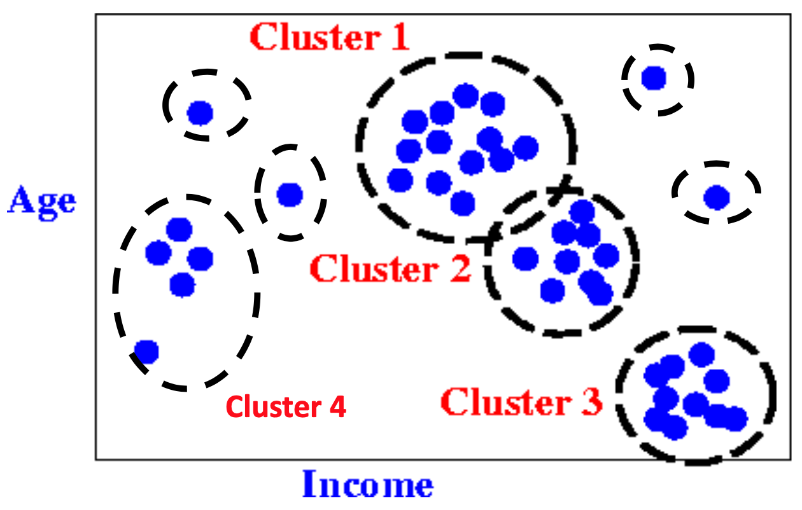
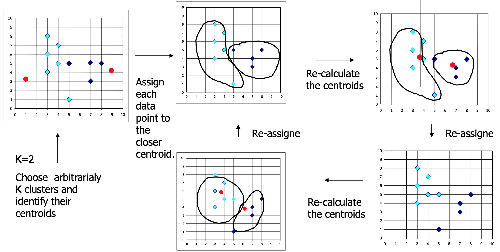

# 📈 Series de Tiempo

- Una serie de tiempo es una secuencia de datos, observaciones o mediciones registradas en orden cronológico, generalmente a intervalos regulares (diarios, mensuales, anuales). Se denota mediante $$\{X_t\}_{t=0,1,2,...}$$

- El análisis de series temporales es fundamental para detectar patrones a lo largo del tiempo, como las tendencias, estacionalidades o ciclos. Esta técnica nos permite realizar proyecciones de la variable de interes, basadas en comportamiento histórico. Se aplica la descomposición de la serie, modelos de autorregresivos integrados de medias móviles (ARIMA) y técnicas de suavizado para estimar y visualizar las tendencias.

\vspace{0.8cm}
- Descomposción de una Serie de Tiempo:

    - Modelo Aditivo: $$X_t = T_t+S_t+e_t$$
    
    Cuándo usarlo: Use el modelo aditivo cuando los patrones estacionales no crezcan o se encojan con el tiempo. 
    
    - Modelo Multiplicativo: $$X_t = T_t \times S_t \times e_t$$
    
    Elija el modelo multiplicativo cuando el efecto estacional crezca o se reduzca en conjunto con la tendencia. 
    
Donde $T_t$ es la Tendencia, $S_t$ es la estacionalidad y $e_t$ es el componente aleatorio (ruido).

### Visualizaciones

- Uso de la libreria `tidyquant`, datos financientos en las compañias tecnológicas de USA. 

- Uso de `ggplot2`

```{r}
FANG_daily <- FANG %>%
    group_by(symbol)

FANG_daily %>%
    ggplot(aes(x = date, y = adjusted, color = symbol)) +
    geom_line(size = 1) +
    labs(title = "Precio Diario de las Acciones",
         x = "", y = "Precio Ajustado", color = "") +
    facet_wrap(~ symbol, ncol = 2, scales = "free_y") +
    scale_y_continuous(labels = scales::dollar) +
    theme_tq() + 
    scale_color_tq()
```

- Uso de `plot_time_series`, los graficos incluyen un **Suavizado** (método `LOWESS`) que sirve para describir la **TENDENCIA**

```{r}

FANG %>% 
  group_by(symbol) %>% 
  plot_time_series(date, adjusted, .facet_ncol = 2, .interactive = FALSE) + ggtitle("Precio de Cierre Ajustado")
```


- Las series de tiempo presentan un **crecimiento** a travez del tiempo, esto es **TENDENCIA CRECIENTE**.


```{r}
FANG %>% 
  group_by(symbol) %>% 
  plot_time_series(date,volume, .facet_ncol =2, .interactive = FALSE) + ggtitle("Volumen de Negocios")
```

- Las series de tiempo presentan estabilidad (no crecen ni decrecen), esto se denomina **ESTACIONARIEDAD**, pero presentan mucha **VARIABILIDAD** (los picos abrutos a lo largo del tiempo).

- Uso de la libreria `UKgrid`, datos de consumo de electricidad en **UK**

```{r}
library(UKgrid)
uk_data <- 
  UKgrid %>% 
  clean_names() %>% 
  select(timestamp, nd)

uk_monthly_data <- 
  uk_data %>% 
  summarize_by_time(.date_var = timestamp,
                    .by = "month",
                    nd = sum(nd, na.rm = TRUE))

ggplot(data = uk_monthly_data, aes(x = timestamp, y = nd)) +
  geom_line() +
  geom_smooth(se = FALSE) +
  labs(x = "", y = "Demanda de Electricidad") +
  scale_x_datetime(date_breaks = "year", date_labels = "%b-%Y")+
  theme(axis.text.x = element_text(angle = 45, vjust = 0.5, hjust = 1))
```

- La serie de tiempo componente **ESTACIONAL** y de **TENDENCIA**.

```{r}
plot_time_series(uk_monthly_data, 
                 .date_var = timestamp,
                 .smooth = TRUE,
                 .value = nd,
                 .interactive = TRUE,
                 .x_lab = "",
                 .y_lab = "Demanda de Electricidad")
```

- Gráfico interactivo, visualizado unicamente en `html`.

### Descomposición

- Recuerda que toda serie de tiempo $X_t$ tiene componentes: tendencia $T_t$, Estacional $S_t$ y residuo $e_t$ (remainder)

```{r}
data("AirPassengers")
decomposed <- stl(AirPassengers, s.window = "periodic")
plot(decomposed)
```


```{r}
decomposed_add <- decompose(AirPassengers, type = "additive")
plot(decomposed_add)
```

```{r}
decomposed_mult <- decompose(AirPassengers, type = "multiplicative")
plot(decomposed_mult)
```

### Modelo ARIMA(p,d,q)

- Los modelos autorregresivos integrados de medias móviles (ARIMA) se especifican mediante tres parámetros $(p, d, q)$. El proceso de modelamiento de un modelo ARIMA se conoce como el método **Box-Jenkins**.

1. **Identificación del Modelo**: El primer paso es lograr que la serie sea estacionaria, a menudo mediante diferenciación $d$. Se analizan gráficos de autocorrelación (ACF) y autocorrelación parcial (PACF) para determinar los órdenes $q$ (media móvil) y $p$ (autorregresivo) respectivamente del modelo $ARIMA(p,d,q)$.

2. **Estimación de Parámetros**: Se calculan los coeficientes para los componentes $AR$ y $MA$ identificados, a menudo buscando minimizar criterios como el de Akaike (AIC) o Schwarz.
    
3. **Verificación Diagnóstica** (Chequeo): Se examinan los residuos del modelo para confirmar que no tengan estructura (ruido blanco). Si no es así, el modelo se ajusta y se repite el proceso desde el paso 1.

4. **Pronóstico**: Una vez que el modelo es adecuado, se utiliza para proyectar valores futuros, generalmente eficiente para el corto plazo. 
    
- El modelo autoregresivo $AR(p)$ se refiere al uso de valores pasados en la ecuación de regresión para la serie $X_t$. El parámetro autoregresivo $p$ especifica el número de pasos atras utilizados en el modelo. Por ejemplo, $AR(2)$ o, de manera equivalente, $ARIMA(2,0,0)$, se representa como:

$$X_t=\mu+\phi_1X_{t-1}+\phi_2X_{t-2}+e_t$$
- El modelo de media móvil $MA(q)$ representa el error del modelo como una combinación lineal de términos de error anteriores $e_t$. El orden $q$ determina el número de términos a incluir en el modelo

$$X_t = \mu + \theta_1e_{t-1}+\theta_2e_{t-2}+...+\theta_q e_{t-q} $$

- La $d$ representa el grado de diferenciación de la serie $X_t$. Diferenciar una serie implica simplemente restar sus valores actuales y anteriores $d$ veces, por ejemplo si $d=1$, ($X_t-X_{t-1}$). A menudo, la diferenciación se utiliza para estabilizar la serie cuando no se cumpla la suposición de **ESTACIONARIEDAD**,

- Los modelos ARIMA también se pueden especificar a través de una estructura `ESTACIONAL` mediante los parametros $(P,D,Q)_M$, donde $M$ representa el periodo estacional.

- Limitaciones, como se basan directamente en valores pasados de $X_t$, por lo tanto, funcionan mejor en series largas y estables.

- Ejemplo: datos de AirPassengers, usando `auto.arima`

```{r}
AP <- log(AirPassengers) # Usar transformacion log
model <- auto.arima(AP)
model
```

- Funcion de autocorrelacion de los residuales

```{r}
acf(model$residuals, main = 'Correlogram')
```

- Funcion de autocorrelacion parcial

```{r}
pacf(model$residuals, main = 'Partial Correlogram' )
```

- Prueba de Ljung-Box para probar que los residuales son ruido blanco (normales con varianza constate.)

```{r}
Box.test(model$residuals, lag=20, type = 'Ljung-Box')
```

-  Histograma de los residuales para visualizar normalidad

```{r}
hist(model$residuals,
     col = 'magenta',
     xlab = 'Error',
     main = 'Histograma de los Residuales',
     freq = FALSE)
lines(density(model$residuals))
```

- Predicciones 48 pasos adelante.

```{r}
f <- forecast(model, 48)
autoplot(f)
```

### Produccion de Cobre-Cusco

- La producción de cobre mensual en Cusco desde enero del 2003 hasta enero del 2026, medido en toneladas métricas finas (tm.f)

- Datos obtenidos de: 
[https://estadisticas.bcrp.gob.pe/estadisticas/series/mensuales/resultados/RD12957DM/html](https://estadisticas.bcrp.gob.pe/estadisticas/series/mensuales/resultados/RD12957DM/html)

```{r}
df <- read.csv("datasets/cobre-cusco.csv")
cobre_ts <- ts(df$Cobre, start = c(2003, 1), frequency = 12)
plot(cobre_ts)
```


```{r}
data("cobre_ts")
decomposed <- stl(cobre_ts, s.window = "periodic")
plot(decomposed)
```


```{r}
cobre_ts <- log(cobre_ts)
model1 <- auto.arima(cobre_ts)
model1
```

- Funcion de autocorrelacion de los residuales

```{r}
acf(model1$residuals, main = 'Correlogram')
```

- Funcion de autocorrelacion parcial

```{r}
pacf(model1$residuals, main = 'Partial Correlogram' )
```

- Prueba de Ljung-Box para probar que los residuales son ruido blanco (normales con varianza constate.)

```{r}
Box.test(model1$residuals, lag=20, type = 'Ljung-Box')
```

-  Histograma de los residuales para visualizar normalidad

```{r}
hist(model1$residuals,
     col = 'magenta',
     xlab = 'Error',
     main = 'Histograma de los Residuales',
     freq = FALSE)
lines(density(model1$residuals))
```

- Predicciones 48 pasos adelante.

```{r}
f <- forecast(model1, 24)
autoplot(f)
```


# 🤖 Clasificación

- Clasificación es una tarea fundamental de `Estadística` y `Machine Learning` que implica **categorizar** los elementos en grupos o clases predefinidos en función de ciertas características.

- En la actualidad se clasifican datos de forma **supervisada** donde se provee la variebla respuesta ($Y$: variable respuesta, clase). Por otro lado, la clasificación no supervisada mejor conocida como agrupamiento `Clustering` no se conoce las clases ($Y$)

### Regresion Logística.

- Es un método estadístico utilizado para predecir la probabilidad de un resultado binario ($Y=0,1$) en función de las predictoras ($X_1,X_2,...,X_n$).

- Es un modelo lineal generalizado, lo que significa que utiliza una función lineal para modelar los *log-Odds* (logaritmo de las chances).

$$\log(\frac{p}{1-p})=\beta_0+\beta_1 X_1+\beta_2 X_2+...+\beta_n X_n$$
o equivalentemente

$$p=\frac{e^{\beta_0+\beta_1 X_1+\beta_2 X_2+...+\beta_n X_n}}{1+e^{\beta_0+\beta_1 X_1+\beta_2 X_2+...+\beta_n X_n}}$$
Donde $p$ es la probabilidad de que ocurra el evento $Y=1$

- Para fines de `clasificación`, la forma más sencilla de distinguir entre las dos clases es considerar que cuando $p>0.5$ la instancia pertenece a la clase de interés $Y=1$.


### Titanic Dataset

{width=90%}

[https://www.kaggle.com/datasets/yasserh/titanic-dataset](https://www.kaggle.com/datasets/yasserh/titanic-dataset)


- Desarrollar un modelo predictivo que responda a la pregunta: "¿qué tipo de personas tenían más probabilidades de sobrevivir?" utilizando datos de pasajeros (es decir, nombre, edad, sexo, clase socioeconómica, etc.)

```{r}
glimpse(titanic_train)
```

### Modelo Básico

```{r}
# Simple cleaning: remove rows with missing Age or Fare
titanic_clean <- na.omit(titanic_train[, c("Survived", "Pclass", "Sex", "Age", "SibSp", "Parch", "Fare")])

# Ensure categorical variables are factors
titanic_clean$Survived <- as.factor(titanic_clean$Survived)
titanic_clean$Sex <- as.factor(titanic_clean$Sex)
titanic_clean$Pclass <- as.factor(titanic_clean$Pclass)
```

```{r}
# Fit the generalized linear model
model <- glm(Survived ~ Pclass + Sex + Age + SibSp, 
             data = titanic_clean, 
             family = binomial(link = "logit"))

# View model coefficients and significance
summary(model)
```


```{r}
# Predict probabilities for the training set
probabilities <- predict(model, type = "response")

# Convert probabilities to binary outcomes
predictions <- ifelse(probabilities > 0.5, 1, 0)

# Create a confusion matrix to check accuracy
table(Predicted = predictions, Actual = titanic_clean$Survived)
```

```{r}
# Calculate basic accuracy
accuracy <- mean(predictions == titanic_clean$Survived)
print(paste("Model Accuracy:", round(accuracy, 4)))
```


### Tidy Modeling

-  [https://www.tidymodels.org](https://www.tidymodels.org)

-  bootstrapping es un método de remuestreo, utilizado para estimar la incertidumbre de un rendimiento estadístico. 

- Implica tomar muestras repetidas del mismo tamaño que el conjunto de datos original, pero con reemplazo.

- Usos: Evitar sobreajuste. Puede ajustar un modelo a muchas muestras de arranque para ver cuánto varían sus coeficientes, proporcionando una distribución en lugar de una estimación de un solo punto.

```{r}
library(tidymodels)
set.seed(2026)
titanic_folds <- bootstraps(data = titanic_train, times = 25)
titanic_folds
```

- Especificaciones del modelo, usando del paquete `glm`

```{r}
titanic_glm_spec <- 
  logistic_reg() %>%
  set_engine('glm') %>%  
  set_mode('classification')
titanic_glm_spec
```

- *Feature Engineering* (Ingenieria de Variables), usando el paquete `recipe`

```{r}
titanic_recipe <- 
  recipe(Survived ~ Pclass + Sex + Age + SibSp + Parch + Fare + Embarked, data = titanic_train) %>%
  step_impute_median(Age,Fare) %>% 
  step_impute_mode(Embarked) %>% 
  step_mutate_at(Survived, Pclass, Sex, Embarked, fn = factor) %>% 
  step_mutate(Travelers = SibSp + Parch + 1) %>% # nueva variable
  step_rm(SibSp, Parch) %>% # eliminar variables
  step_dummy(all_nominal_predictors()) %>% # crear indicadoras 
  step_normalize(all_numeric_predictors()) # normalizar variables 
```

- *Workflow* (flujo de trabajo)

```{r}
doParallel::registerDoParallel() # el remuestreo es paralelizable (HPC)
titanic_glm_wf <- 
  workflow() %>% 
  add_recipe(titanic_recipe) %>% 
  add_model(titanic_glm_spec) %>% 
  fit_resamples(titanic_folds)
titanic_glm_wf
```

- Recopilar métricas (precisión y área bajo la curva característica de operación)
s
```{r}
collect_metrics(titanic_glm_wf)
```

- Brier es análoga al error cuadrático medio en los modelos de regresión. (con 0 indicando predicciones perfectas.) [https://yardstick.tidymodels.org/reference/brier_class.html](https://yardstick.tidymodels.org/reference/brier_class.html)

- Usamos como un ajuste final para todos los datos de entrenamiento.

```{r}
titanic_glm_last_wf <- workflow() %>% 
  add_recipe(titanic_recipe) %>% 
  add_model(titanic_glm_spec)
final_fit <- fit(object = titanic_glm_last_wf, data = titanic_train)
final_fit
```

- Feature Importance: En regresión logística (GLM), el FI de los predictores se determina principalmente por la magnitud de los coeficientes estandarizados, donde valores absolutos mayores indican predictores más fuertes.

```{r}
library(vip)
final_fit %>%
  extract_fit_parsnip() %>%
  vip(num_features = 10)
```


### K-Means

- K-means es un algoritmo de agrupamiento (*Clustering*) de aprendizaje automático no supervisado, que particiona $n$ datos en $k$ distintos grupos (*clusters*), minimizando la distancia entre los puntos y su centroide de cada cluster.

{width=90%}

- La idea principal del *clustering* es agrupar instancias (filas), variables (columnas) o ambas simultáneamente, según la separación entre ellas. Esta separación se determina mediante una medida de distancia denominada **medida de disimilitud**. Se asume que se desconocen las clases a las que pertenecen las instancias.

- K-means es un método basado en `Particionamiento`: El conjunto de datos se divide en un número $K$ de *clusters* predefinidos, y luego, de forma iterativa, los puntos de datos se reasignan a un *cluster* hasta que se cumple un criterio de parada. Generalmente, esto ocurre cuando se minimiza una función, como la suma de los cuadrados dentro de cada *cluster*.

- K-means (*MacQueen*, 1967): "El objetivo es minimizar la disimilitud de los datos dentro de cada *cluster* y maximizar la disimilitud de los datos que pertenecen a *clusters* distintos."

- **ALGORITHM:**

    - `IMPUT`: Un conjunto de datos $S$ and el número de *clusters* $K$.
    - `OUTPUT`: Una lista $L$ de *clusters* donde cada dato de $S$ es asignado.
    
    1. Selecionar los centroides iniciales de los $K$ clusters: $c_1, c_2, ..., c_K$.
    2. Asignar cada dato $x_i$ de $S$ al *cluster* $C_i$ , talque su centroide $c_i$ esta cercano a $x_i$, esto es: $$C_i= argmin_{1\leq k \leq K} || x_i-c_k||$$
    3. Para cada *cluster*, el centroide es recalculado, basado en los datos contenidos en el *cluster* y minimizando la suma de cuadrados dentro de cada *cluster*, esto es: $$WSS=\sum_{k=1}^K \sum_{C_i=k}||x_i-c_k||^2$$.
    4. ir al paso 2, hasta lograr la convergencia.

- Paso a Paso: $K=2$

{width=100%}

- Animado $K=3$

{width=100%}


- Alternativas para escoger los $K$ centroides iniciales:

    - Usar los $K$ primeras instancias (observaciones).
    - Escoger aleatoriamente $K$ instancias.

- Ventajas

    - Computacionalmente rápido.
    - Rubusto a valores perdidos.

- Desventajas

    - Sensible a valores extremos (*outliers*)
    - El criterio de optimización no se logra de forma global, unicamnete de forma local.
    

### K-means diabetes

- [https://www.kaggle.com/datasets/mathchi/diabetes-data-set?resource=download](https://www.kaggle.com/datasets/mathchi/diabetes-data-set?resource=download)

```{r}
diabetes <- read.csv("datasets/diabetes.csv", header = TRUE)
glimpse(diabetes)
```

```{r}
diabetes %>% 
  ggplot(aes( BMI , Glucose)) +
  geom_point()
```

```{r}
diabetes_clust <- kmeans(select(diabetes, -Outcome), centers = 2)
summary(diabetes_clust)
```

```{r}
library(broom)
tidy(diabetes_clust)
```


```{r}
augment(diabetes_clust, diabetes) %>%
  ggplot(aes(BMI,Glucose, color = .cluster)) +
  geom_point()
```

```{r}
kclusts <-
  tibble(k = 1:9) %>%
  mutate(
    kclust = map(k, ~ kmeans(select(diabetes, -Outcome), .x)),
    glanced = map(kclust, glance)
  )

kclusts %>%
  unnest(cols = c(glanced)) %>%
  ggplot(aes(k, tot.withinss)) +
  geom_line(alpha = 0.5, size = 1.2, color = "midnightblue") +
  geom_point(size = 2, color = "midnightblue")
```


```{r}
final_clust <- kmeans(select(diabetes, -Outcome), centers = 3)
```

```{r}
library(plotly)

p <- augment(final_clust, diabetes) %>%
  ggplot(aes(BMI, Glucose, color = .cluster, name = Outcome)) +
  geom_point()

ggplotly(p, height = 500)
```


### Palmer Penguins Original

```{r}
data("penguins", package = "modeldata")
penguins1 <- penguins %>%
  drop_na()
```


```{r}
penguins1 %>% 
  ggplot(aes( bill_length_mm , bill_depth_mm, color= species)) +
  geom_point()
```


### K-Means Palmer Penguins

- bill_length_mm y bill_depth_mm

```{r}
data("penguins", package = "modeldata")
penguins <- penguins %>%
  select(bill_length_mm, bill_depth_mm) %>%
  drop_na()
# shuffle rows
penguins <- penguins %>%
  sample_n(nrow(penguins))
glimpse(penguins)
```


```{r}
penguins %>% 
  ggplot(aes( bill_length_mm , bill_depth_mm)) +
  geom_point()
```


```{r}
penguins_clust <- kmeans(penguins, centers = 3)
summary(penguins_clust)
```


```{r}
tidy(penguins_clust)
augment(penguins_clust, penguins) %>%
  ggplot(aes(bill_length_mm,bill_depth_mm, color = .cluster)) +
  geom_point()
```

`COMPARACION`

```{r}
penguins1 %>% 
  ggplot(aes( bill_length_mm , bill_depth_mm, color= species)) +
  geom_point()
```


### K-Means Palmer Penguins

- bill_length_mm, bill_depth_mm, flipper_length_mm, body_mass_g

```{r}
data("penguins", package = "modeldata")
penguins <- penguins %>%
  select(bill_length_mm, bill_depth_mm,flipper_length_mm,body_mass_g) %>%
  drop_na()
glimpse(penguins)
```


```{r}
penguins_clust <- kmeans(penguins, centers = 3)
summary(penguins_clust)
```


```{r}
tidy(penguins_clust)
augment(penguins_clust, penguins) %>%
  ggplot(aes(bill_length_mm,bill_depth_mm, color = .cluster)) +
  geom_point()
```


`EXPLORAR PCA PREVIAMENTE Y LUEGO K-MEANS`


# 🇵🇪 Datos Perú

- [https://estadisticas.bcrp.gob.pe/estadisticas/series/](https://estadisticas.bcrp.gob.pe/estadisticas/series/)

- [https://www.inei.gob.pe/estadisticas-indice-tematico/](https://www.inei.gob.pe/estadisticas-indice-tematico/)

- [https://systems.inei.gob.pe/SIRTOD/](https://systems.inei.gob.pe/SIRTOD/)

